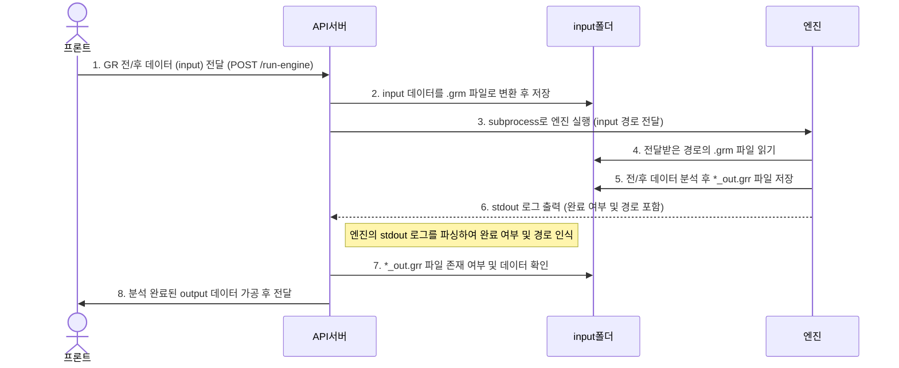

## FastAPI 백엔드 개발 및 빌드 가이드 (Windows 전용)

FastAPI 백엔드 로컬 개발 및 배포용 빌드를 위한 가이드입니다.

---

### 1️⃣ **백엔드 디렉토리로 이동**

```powershell
cd backend
```

---

### 2️⃣ **가상환경 생성 (선택)**

가상환경을 사용하는 경우:

```powershell
python -m venv .venv
```

---

### 3️⃣ **가상환경 활성화 (선택)**

```powershell
.venv\Scripts\activate
```

---

### 4️⃣ **의존성 설치**

로컬 개발용 의존성 설치:

```powershell
pip install -r requirements-local.txt
```

---

### 5️⃣ **작업 완료 후 가상환경 비활성화 (선택)**

```powershell
deactivate
```

---

## 🚀 **FastAPI 빌드 (PyInstaller)**

배포용 실행 파일 빌드를 진행하려면 아래 명령어를 사용하세요:

```powershell
pnpm run build:python
```

### 해당 명령은 다음 작업을 자동으로 수행합니다:

```
"build:python": "cd backend && pip install -r requirements-build.txt && python auto_hidden_imports.py && pyinstaller main.spec --noconfirm"
```

* `requirements-build.txt` 기반 빌드용 의존성 설치
* `auto_hidden_imports.py` 실행으로 hiddenimports 자동 갱신
* PyInstaller로 빌드 수행 
* `dist/win-unpacked/resources/backend/main/main.exe` 경로에 서버 생성

---


## 시퀀스 다이어그램

## 단계별 설명
1. 프론트 → FastAPI 서버
    - POST /run-engine API로 GR 전(before), 후(after) 데이터를 전달. 
    - 데이터는 before, after 구조와 분석 파라미터 포함.

2. FastAPI 서버 → input 폴더 
   - 전달받은 데이터를 .grm 확장자로 변환하여 저장 (실제 내용은 JSON 포맷, 확장자만 .grm).

3. FastAPI 서버 → 엔진
   - subprocess를 사용해 pyGRsim 엔진 실행, input 경로 인자로 전달.

4. 엔진 → input 폴더
   - 엔진이 전달받은 경로의 .grm 파일을 읽어 분석 시작.

5. 엔진 → input 폴더
   - 분석 완료 후 동일 경로(input 폴더)에 *_out.grr 파일로 결과 저장.

6. 엔진 → FastAPI 서버
   - 엔진은 stdout으로 완료 로그 및 결과 경로를 출력.

7. FastAPI 서버 내부 처리
   - 엔진의 stdout 로그를 실시간 파싱하여 완료 여부 및 결과 경로를 인식.

8. FastAPI 서버 → input 폴더
   - _out.grr 파일의 존재 여부 및 데이터를 확인.

9. FastAPI 서버 → 프론트
   - 분석 완료된 데이터를 가공 후 프론트에 반환.